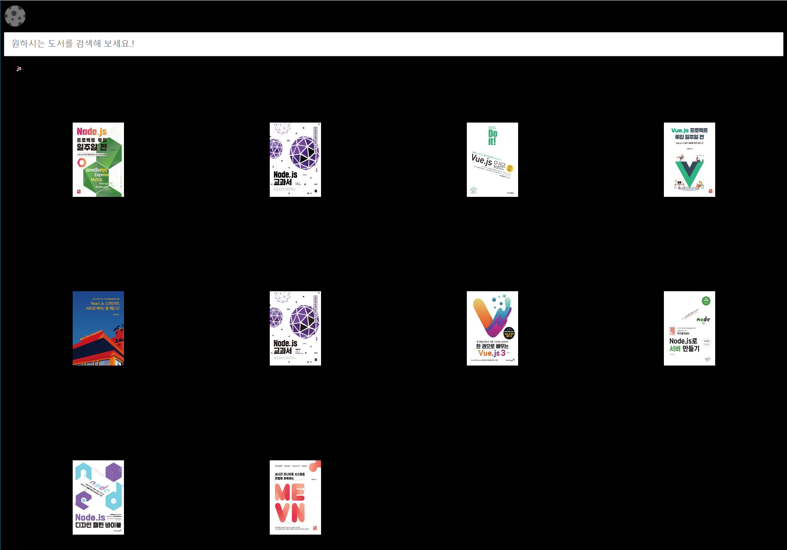
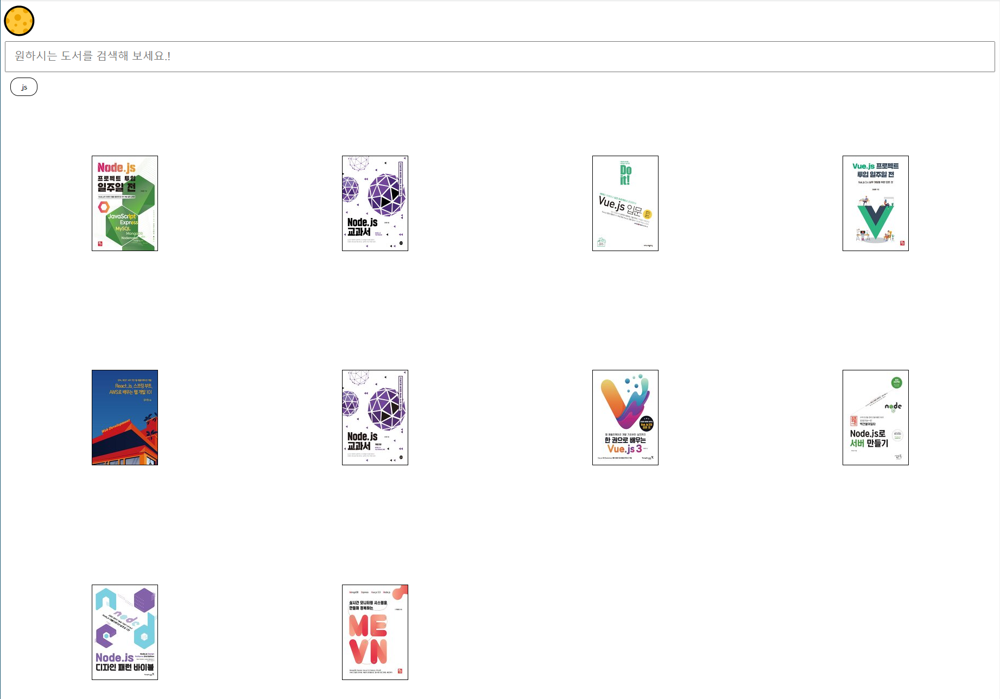
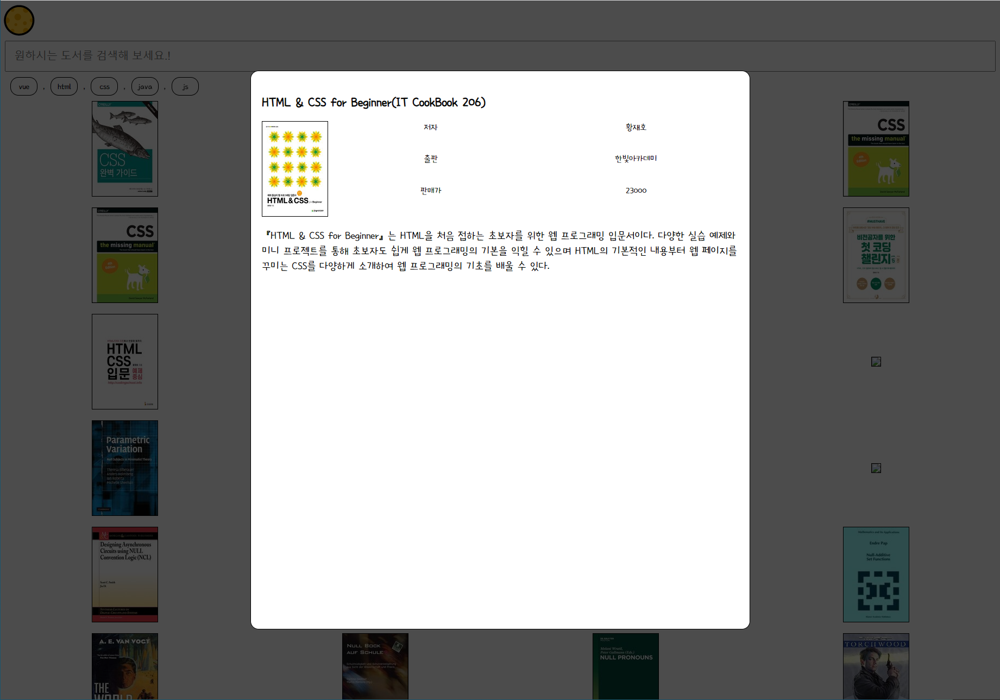

# Vanilla js로만 이용하여 어플리케이션 제작하기.

### 웹사이트 링크
[Show DemoPage](https://yongjin-jo.github.io/kakao-book-search-vainillajs/).

### 사용 API 
kakao Book Search

## 동기

나는 React, Vue를 사용하면서 어느 정도 웹페이지를 만들 수 있다고  생각했습니다. 문득 웹페이지를 만들면서 나는 library와 framwork만 조금 사용할 줄 아는 것 아닐까  생각을 하게 되었다. 그래서 Vanilla js만으로 웹페이지를 만들어 보겠다는 결심을 하게 되어 제작하게 되었습니다.

## 주요 구현 기능

### 다크 모드 기능 구현

### keyword 기능 구현

 - 클릭 시 클릭 한 Keyword 값에 대한 Fetch 기능 구현
 - 5개 이상 클릭시 가장 오래된 Keyword 삭제

### 모달 기능 구현, 애니메이션 ( fade in, fade out) 기능 적용

### 검색 기능 구현, localstorage 키워드 저장 기능 구현
 - 검색시 키워드 저장 기능 구현

### fetch 기능 구현

### infinite scroll 기능 구현

### loder 기능 구현